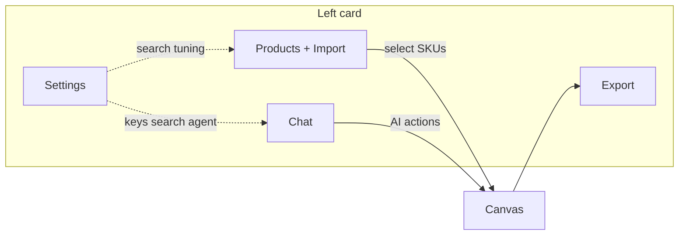

# Left panel — Settings, import, search & API roadmap

**Audience:** product, design, engineering.  
**Context:** Today `AdCanvasEditor` has four bottom tabs — **Chat**, **Products**, **Export**, **Settings** — and Settings is still a stub (`AdCanvasEditor.tsx`). This document defines **where** capabilities live, **how** they behave, and the **split** between locked-in system behavior (our code) vs user-configurable surfaces (API, prompts, import preferences).

### North star — API-first catalog, one-stop workspace

- **Long-term primary source** for end users is **their own catalog API** (sync, pagination, fields the agent needs). Excel is a **temporary / bootstrap** path for onboarding and demos, not the architectural end state.
- **Today:** we may not have a customer API available for end-to-end testing; that is exactly why we invest in **Settings tools** — BYOK LLM, future **Connections** for catalog endpoints, **Search** tuning, **Import** presets, **Agent** brief, **Design** defaults — so agent users can **wire and tune** their stack inside Oraicle without forking core agent behavior.
- **Product intent:** a **one-stop factory** — connect data, tune how search feels, steer the creative agent, polish export — without leaving the retail-promo workspace. “Train your API” here means **configure + validate + bounded prompts**, not replacing Oraicle’s safety and schema in code.

---

## 1. Design principles

### 1.1 One mental model for users

| Layer | What it is | User feels |
|-------|------------|------------|
| **Canvas (center)** | WYSIWYG — the ad you’re designing | “I’m moving pixels and copy.” |
| **Left card** | Pipeline: **data → search → AI help → export** | “I’m feeding the machine and tuning how it helps me.” |
| **Settings (left)** | Anything that is **not** a direct drag on the artboard but changes **behavior** | “Workspace rules: keys, imports, search, brand defaults.” |

Avoid duplicating the same control in Chat and Settings unless one is a **shortcut** (with a link: “Configured in Settings → Search”).

### 1.2 System vs user — non-negotiable split

| **Locked in code (users cannot break)** | **User-configurable (advanced, bounded)** |
|----------------------------------------|-------------------------------------------|
| Agent action schema (`block_patch`, `catalog_filter` resolution, layout IDs) | API key / optional base URL (BYOK, self-hosted inference) |
| `AGENT_SYSTEM_PROMPT` / `SUGGESTION_SYSTEM_PROMPT` **structure** and safety rules | **Supplemental** “brand voice” / creative brief text **prepended or appended** within token budget |
| Canvas math (`canvas-pages`, max per page, multi-page rules) | Search: min score slider, “strict vs fuzzy” **within** our indexer API |
| Server-side `selectProducts`, Meilisearch query contract | **Synonyms / stopwords** file or UI **if** we expose index config (often admin-only) |
| Validation of LLM JSON, normalization, dedup | Import column mapping for Excel (saved **presets**, not raw code) |
| Default model list and fallbacks | Model **preference** (fast vs smart) — already in Chat header |

**Rule:** Users never edit raw system prompts as free text that replaces ours; they get **additive** fields (“Additional instructions for the agent”) with **length limits** and **sanitization**, merged server-side or client-side **after** our system prompt.

### 1.3 Progressive disclosure

- **Default:** Products + Chat + Export — no overwhelm.  
- **Settings:** structured sections with **Basic** vs **Advanced** (collapsible).  
- **“Dangerous” or rare:** API URL override, raw index name — behind **Advanced** + confirmation.

---

## 2. Information architecture — where things live

### 2.1 Recommended mapping (fits current 4 tabs)

| Tab | Primary content | Roadmap additions |
|-----|-----------------|-------------------|
| **Chat** | Conversation, model toggle, suggestions mute, quick actions | Optional: link “Workspace instructions” → opens Settings → Agent. **No** heavy API forms here. |
| **Products** | Catalog list, selection, search bar, filters, **import entry points** | Clear **Import** block at top: Excel, paste, optional CSV/API sync stub. Search bar stays; deep **search tuning** links to Settings → Search. |
| **Export** | PNG/HTML, resolution, download | Later: default file naming, batch — still Export. |
| **Settings** | **Hub** for non-canvas configuration | Sections below (vertical list or accordion). |

**Why not a 5th tab?** Four tabs already match Figma-like muscle memory; **Settings** should absorb configuration density via **internal navigation**, not more top-level tabs (reduces horizontal crowding on small laptops).

### 2.2 Settings — proposed internal structure (top → bottom)

Use **one scroll** with **sticky subheadings** or **accordion** (`Connections` | `Import` | `Search` | `Agent` | `Design defaults`).

#### A. Connections (API & environment)

- **LLM:** API key (masked), optional base URL for self-hosted compatible API (advanced).  
- **Status:** last successful call / error (no secrets in logs).  
- **Catalog / search backend:** if applicable — Meilisearch host + key (often **read-only** client key), or “Use Oraicle default” toggle for hosted tier.

*Placement rationale:* This is **credentials**, not creative — belongs in Settings, not Chat.

#### B. Import

- **Excel:** mapping wizard (column → field), delimiter, header row, **save preset** (“Electronics price list”) — important for **today’s** workflows; not the only long-term ingestion path.  
- **Catalog API (primary target):** base URL, auth (header / key), sync cadence, field mapping — lives under the same **Import / Connections** story over time so the UI stays one place for “how products arrive.”  
- **Manual / paste:** same as today but surfaced as a **card** under Import with short help.  
- **Future:** scheduled fetch, ERP/Magento hooks — same section.

*Placement rationale:* Import is **data ingestion**; it pairs with Products but **configuration** of mappings is **infrequent** → Settings; **one-click “Import Excel”** can still **shortcut** from Products to the same wizard (modal or deep-link to Settings?tab=import).

#### C. Search

- **Behavior:** min score / typo tolerance (sliders within safe bounds enforced in code).  
- **Scope:** “Search in: name, code, description” toggles **if** indexer supports.  
- **Link:** “How search works” → docs snippet.  
- **Power:** reset index, re-upload catalog (if user-owned index).

*Placement rationale:** Tuning search is **not** picking products — separate from Products list UI; users often say “search feels wrong” → one place to fix.

#### D. Agent (user-facing “prompt engineering lite”)

- **Locked:** Read-only summary: “Agent uses Oraicle retail templates; you cannot disable safety rules.”  
- **Editable:**  
  - **Creative brief** (short textarea): merged into user context as `userBrief` — **not** replacing system prompt.  
  - **Language default** (if not inferred from UI).  
  - Optional **negative instructions** (“Never use ALL CAPS headlines”) — length-capped.

*Placement rationale:** Separates **chat** (turn-by-turn) from **persistent preferences** (brief applies every turn until cleared).

#### E. Design defaults (end-stage polish at workspace level)

- **Defaults for new ads:** default format (Story vs Square), default layout, default style palette.  
- **Brand kit (light):** saved primary/accent hex, default logo slot — **not** replacing per-canvas overrides.  
- **Footer / legal:** link to saved footers (already in product direction).

*Placement rationale:** “How every **new** canvas starts” vs canvas blocks which are **this** ad.

---

## 3. Flow diagrams (conceptual)

### 3.1 User journey: new user

### 3.2 Configuration vs runtime

- **Settings** writes to **persisted profile** (localStorage → later account API).  
- **Canvas** reads **defaults** on new creative; **Chat** merges **brief** from profile each turn.

---

## 4. UI / UX patterns (how it should look)

| Pattern | Use |
|---------|-----|
| **Accordion sections** in Settings | Reduces vertical noise; remember last expanded (local). |
| **Badges** on Settings tab | “Action required” if API key missing (optional). |
| **Import wizard** | Stepper: file → map columns → preview rows → confirm. |
| **Toasts** | Success/fail import; never block canvas on background sync. |
| **Chat** | Stays **clean** — at most one row: “Using workspace brief · Edit” linking to Settings → Agent. |

**Accessibility:** Settings forms use labels, `aria-describedby` for API key help, no icon-only primary actions.

---

## 5. Phased roadmap (engineering)

| Phase | Scope | Outcome |
|-------|--------|---------|
| **P0 — Shell** | **STORY-171:** `WorkspaceSettingsPanel` + accordion + Products → “Search settings” link | ✅ Shipped |
| **P1 — Connections** | **STORY-172:** BYOK in Settings → Connections + `getResolvedLlmApiKey()` | ✅ Shipped |
| **P2 — Import UX** | Excel mapping wizard + presets (now); **STORY-174:** Catalog API URL/auth/cadence stub in Settings → Import (persist only); **same IA later** for real sync | Bootstrap today; API-first users later |
| **P3 — Search** | **STORY-173:** min-score sliders (long vs short token) + `search-settings-storage` | Aligns with `product-search-min-score` and indexer · ✅ Shipped |
| **P4 — Agent brief** | **STORY-175:** `agent-brief-storage` + Settings → Agent textarea; merge into main + suggestion system prompts | Power users without forking prompts · ✅ Shipped |
| **P5 — Design defaults** | **STORY-176:** `design-defaults-storage` + Settings → Design; initial canvas + “Apply to current ad” | Faster repeated work · ✅ Shipped |
| **P6 — Enterprise** | Encrypted secret storage, org policies, audit | Optional B2B |

Each phase should be **one or more stories** with tests for merge logic (brief + system prompt) and validation bounds (search sliders).

---

## 6. Risks & mitigations

| Risk | Mitigation |
|------|------------|
| Users paste huge “brief” and blow token budget | Hard character cap + server-side truncate with warning |
| Users think they “replaced” the agent | Copy: “Adds to Oraicle agent; does not replace safety rules” |
| API key in localStorage | Educate risk; prefer httpOnly cookie when auth exists |
| Settings tab becomes a junk drawer | Quarterly review; max 5 top-level sections |

---

## 7. Relation to existing code

- **Panel tabs:** `PanelTabBar.tsx` — type `PanelTab` unchanged unless product insists on a 5th tab (not recommended).  
- **Settings content:** today inline in `AdCanvasEditor.tsx` (~1289+) — extract to `WorkspaceSettingsPanel.tsx` when implementing P0.  
- **Agent prompts:** `client/src/lib/agent-chat-engine.ts` — merge user brief **after** this roadmap, not before guardrails are designed.

---

## 8. Summary

- **Products** = *which* SKUs + **shortcuts** to import; **Settings** = *how* import/search/API/agent defaults work.  
- **Chat** = dialogue + model; heavy config stays out.  
- **System brain** stays in code; **users** get bounded, additive knobs and BYOK — matching how serious tools avoid “prompt injection as product.”

*Next step:* pick **P0 shell** + **P1 connections** as the first implementation story set; update `TRACKER.md` accordingly.
